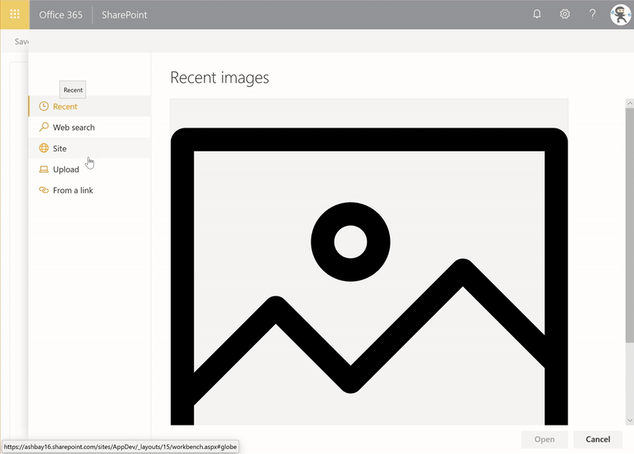
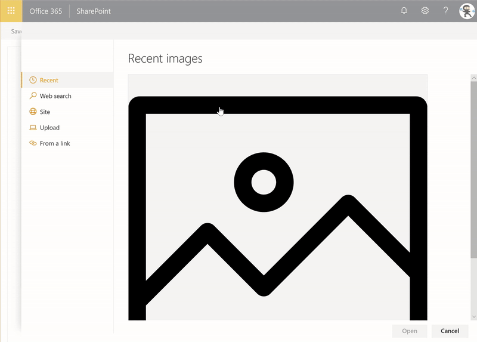
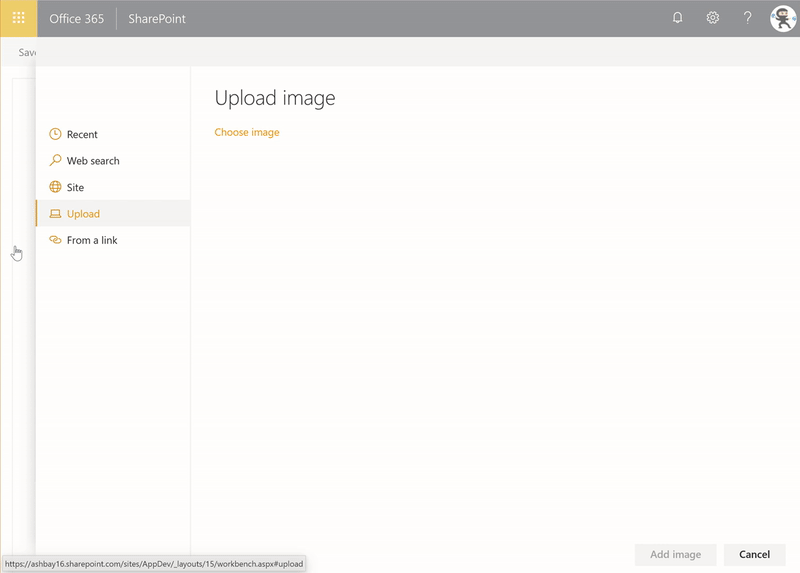
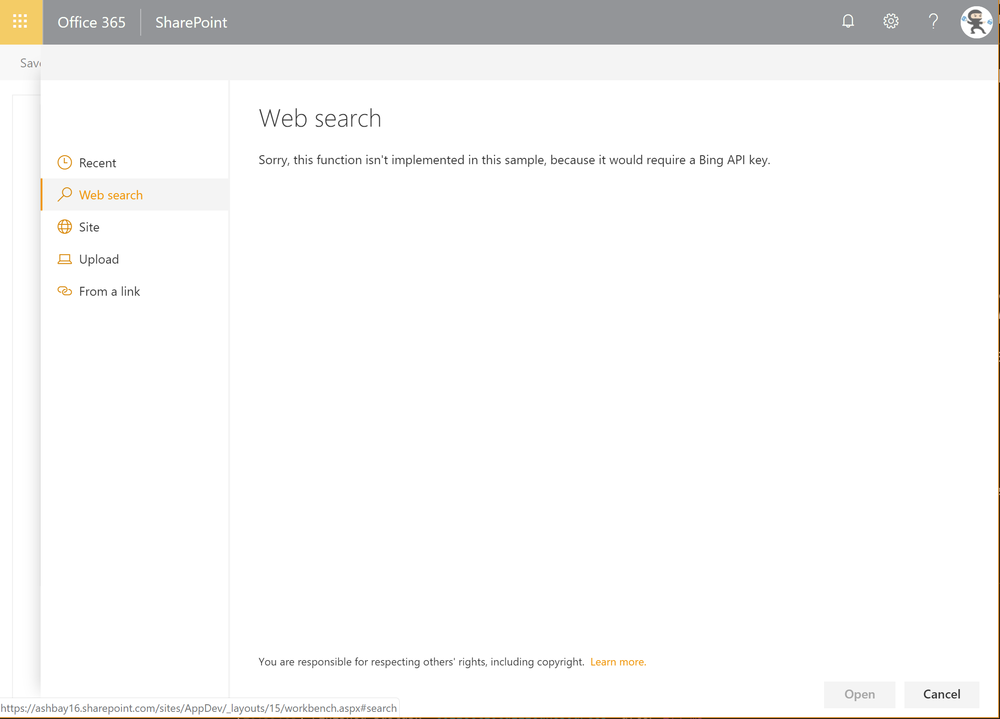

# Image Comparer with File Picker


## Summary

Allows users to compare Before and After pictures, with a draggable slider. Implements a custom file picker.

## Background

The Microsoft UI Fabric team (formerly Office UI Fabric) recently released a [web site](https://fluentfabric.azurewebsites.net/#/components) that allows you to compare the current version of the Office UI Fabric components side by side with their upcoming Fluent versions, using a cool image slider.


I wanted to re-create a version of the slider that would allow a user to compare two images, side by side.

Re-creating the slider was pretty easy (they use [react-draggable](https://github.com/mzabriskie/react-draggable) to handle dragging); I wanted to make it possible for users to select the
Before and After pictures to use the SharePoint File Picker dialog.

After a lot of digging around, I decided to re-create my own.

After all, one of the premises of SPFx is that SPFx gives us -- the SharePoint developer community -- a framework to build the same web parts that Microsoft's own developers do. Right?

This sample re-creates the SharePoint file picker (or, more accurately, the SharePoint image picker) that is used by out-of-the-box web parts such as the Image and Hero web parts. My goal was to create something that would be re-usable,
and would be as close as possible from the out-of-the-box picker. In fact, as I was testing the app, I found myself testing the out-of-the-box picker when I thought I was testing my own file picker.

After building this sample, I can confirm that it _is_ possible to build web parts that look and feel like the out-of-the-box web parts using SPFx.

The file picker includes the following tabs:

### Recent


### Web search


> NOTE: Requires a Bing API key, see below

### OneDrive


### Site



### Upload



### From a link




# Compatibility

 
 


-Incompatible-red.svg "SharePoint Server 2016 Feature Pack 2 requires SPFx 1.1")


## Applies to

* [SharePoint Framework](https://docs.microsoft.com/sharepoint/dev/spfx/sharepoint-framework-overview)
* [Office 365 tenant](https://docs.microsoft.com/sharepoint/dev/spfx/set-up-your-development-environment)

## Solution

Solution|Author(s)
--------|---------
react-comparer | Hugo Bernier ([Tahoe Ninjas](http://tahoeninjas.blog), @bernierh)

## Version history

Version|Date|Comments
-------|----|--------
1.0|January 27, 2019|Initial release


## Minimal Path to Awesome

* Clone this repository
* In the command line run:
  * `npm i`
  * `gulp serve --nobrowser`
* In the web browser navigate to the hosted version of the SharePoint workbench located in the same site as where the Tasks list is, eg. *https://contoso.sharepoint.com/sites/team/_layouts/15/workbench.aspx*.

## Optional Configuration - Bing Search

The sample `PropertyPanelFilePicker` is designed to mimic the standard SharePoint file picker dialog. As such, it includes a **Web search** which uses Bing to return search results.


However, the feature requires a Bing API key in order to work. If you do not have a Bing API key, the `PropertyPanelFilePicker` will display a message indicating that the Bing API key is missing.



### To Configure a Bing API key (Optional)

This sample uses **SharePoint Online Tenant Properties** to store the API key. The idea is that if you get an
API key for your organization to use, you want to store it in one place -- the **Tenant Properties** -- instead of having to re-enter the API key
in every web part that needs it.

To configure your API key, use the following steps:

1. If you don't already have a Bing Web Search API key, go to the [Bing Web Search](https://azure.microsoft.com/en-us/services/cognitive-services/bing-web-search-api/) API page and request a key.
2. To set the API key, you'll need to use the **Office 365 CLI**. If you haven't installed it yet, you can get it [from here](https://pnp.github.io/office365-cli/?utm_campaign=Use+SharePoint+Online+tenant+properties&utm_medium=page&utm_source=msft_docs).
3. Using **Office 365 CLI**, enter the following command, making sure to change **value** with your actual Bing API key, and **appCatalogUrl** with your tenant's app catalog (e.g.: https://contoso.sharepoint.com/sites/apps).

```PowerShell
spo storageentity set --appCatalogUrl <appCatalogUrl> --key BingApi --value <value>
```

4. If you want to verify that your API key is stored, use the following command to list all your tenant properties:

```PowerShell
spo storageentity list --appCatalogUrl <appCatalogUrl>
```

If all goes well, you should see an entry called **BingApi** containing your Bing API key.

### To hide the Web search tab

If you want to use this web part without the **Web search** tab, you can simply disable it from the code. To do so, use the following steps:

1. In the solution, open the **ComparerWebPart.ts** file. 
2. Look for a line at the top of the file that looks like this:

```TypeScript
const DISABLE_WEB_SEARCH_TAB: boolean = false;
```

3. Change the `false` to `true`
4. Save and rebuild/redeploy the web part.

This constant will be applied to both `PropertyPaneFilePicker` controls used in the web part.

You can also simply set each `PropertyPaneFilePicker`'s `disableWebSearchTab` property to `true`.

## Features

* Using Tenant property
* Using of Office UI Fabric React Selection control
* Using of Office UI Fabric React Selection control
* Making CORS calls within an SPFx component

### Resources

* [Fluent for Fabric](https://fluentfabric.azurewebsites.net/#/components)
* [Build custom controls for the property pane](https://docs.microsoft.com/en-us/sharepoint/dev/spfx/web-parts/guidance/build-custom-property-pane-controls)
* [Office UI Fabric](https://developer.microsoft.com/fluentui/)
  * [Button](https://developer.microsoft.com/en-us/fabric#/components/button)
  * [CommandBar](https://developer.microsoft.com/en-us/fabric#/components/commandbar)
  * [DetailsList](https://developer.microsoft.com/en-us/fabric#/components/detailslist)
  * [FocusZone](https://developer.microsoft.com/en-us/fabric#/components/focuszone)
  * [Label](https://developer.microsoft.com/en-us/fabric#/components/label)
  * [Link](https://developer.microsoft.com/en-us/fabric#/components/link)
  * [List](https://developer.microsoft.com/en-us/fabric#/components/list)
  * [MessageBar](https://developer.microsoft.com/en-us/fabric#/components/messagebar)
  * [Nav](https://developer.microsoft.com/en-us/fabric#/components/nav)
  * [Panel](https://developer.microsoft.com/en-us/fabric#/components/panel)
  * [SearchBox](https://developer.microsoft.com/en-us/fabric#/components/searchbox)
  * [Selection](https://developer.microsoft.com/en-us/fabric#/components/selection)
  * [Spinner](https://developer.microsoft.com/en-us/fabric#/components/spinner)
  * [TextField](https://developer.microsoft.com/en-us/fabric#/components/textfield)
* [SharePoint Online tenant properties](https://docs.microsoft.com/en-us/sharepoint/dev/spfx/tenant-properties)
* [@pnp/spfx-controls-react](https://sharepoint.github.io/sp-dev-fx-controls-react/)
  * [Placeholder control](https://sharepoint.github.io/sp-dev-fx-controls-react/controls/Placeholder/)
  * [WebPartTitle](https://sharepoint.github.io/sp-dev-fx-controls-react/controls/WebPartTitle/)
* [@pnp/sp](https://pnp.github.io/pnpjs/sp/docs/)
* [React-draggable](https://github.com/mzabriskie/react-draggable)
* [React-block-image](https://github.com/transitive-bullshit/react-block-image)
* [StackExchange - SPFx calls blocked by CORS policy](https://sharepoint.stackexchange.com/questions/254050/spfx-calls-blocked-by-cors-policy)


## Disclaimer

**THIS CODE IS PROVIDED *AS IS* WITHOUT WARRANTY OF ANY KIND, EITHER EXPRESS OR IMPLIED, INCLUDING ANY IMPLIED WARRANTIES OF FITNESS FOR A PARTICULAR PURPOSE, MERCHANTABILITY, OR NON-INFRINGEMENT.**


