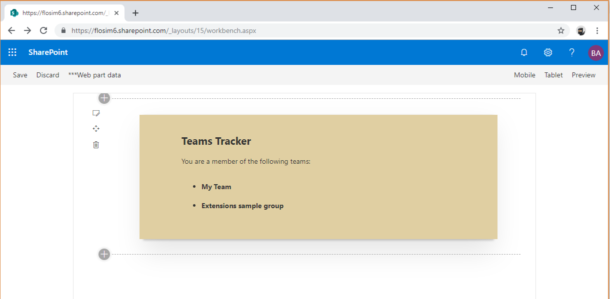
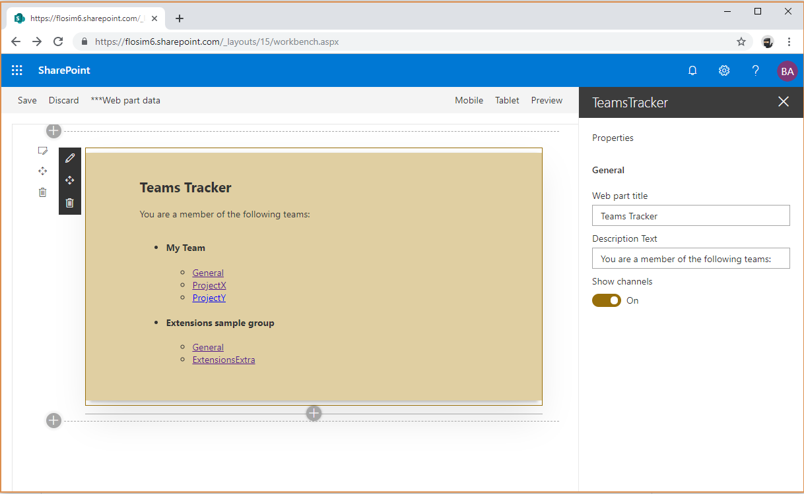

# React Functional Component web part with data fetch

## Summary

This web part demonstrates building a React functional component that uses data from a remote service, in this case the Microsoft Graph, using the recently introduced React Hooks feature. The example web part renders a list of the user's Teams and, optionally, the channels in each Team.




## Compatibility

 
 


-Incompatible-red.svg "SharePoint Server 2016 Feature Pack 2 requires SPFx 1.1")


## Applies to

* [SharePoint Framework](https://docs.microsoft.com/sharepoint/dev/spfx/sharepoint-framework-overview)
* [Office 365 tenant](https://docs.microsoft.com/sharepoint/dev/spfx/set-up-your-development-environment)
* [PnPJS library](https://github.com/pnp/pnpjs)

## Prerequisites

This sample was built with version 1.8.2 of the SharePoint Framework. It has been modified to use version 16.8 of the React framework (by default the version used is React 16.7). React 16.8 supports React Hooks which is required to support state management in a React functional component.
With future versions of SPFx it will be possible to use the built-in React version, which avoids the need to add a specific version of React to the bundle. This sample also uses the PnPJS library to retrieve Microsoft Graph data.

## Solution

Solution|Author(s)
--------|---------
react-functional-component-with-data-fetch | Bill Ayers

## Version history

Version|Date|Comments
-------|----|--------
1.0|June 14, 2019|Initial release

## Minimal Path to Awesome

* Clone this repository
* Move to /samples/react-functional-component-with-data-fetch folder
* At the command line run:
  * `npm install`
  * `gulp serve --nobrowser`
  * Navigate to *https://mytenant.sharepoint.com/_layouts/15/workbench.aspx*
  * Sign in to your account if needed

>  This sample can also be opened with [VS Code Remote Development](https://code.visualstudio.com/docs/remote/remote-overview). Visit https://aka.ms/spfx-devcontainer for further instructions.

## Features

The purpose of this web part is to demonstrate building a React functional component that includes state and data fetched from a remote service. This is achieved using the recent React Hooks feature. The resulting code is cleaner and easier to follow than using a JavaScript/TypeScript class derived from React.Component. The example web part renders a list of the user's Teams and, if enabled, a list of the Teams channels for each Team with a link to the channel.



This is an extension of the approach used in the [React-Functional-Component](https://github.com/pnp/sp-dev-fx-webparts/tree/main/samples/react-functional-component) and [React-Functional-Stateful-Component](https://github.com/pnp/sp-dev-fx-webparts/tree/main/samples/react-functional-stateful-component) samples.

* Simplification
* Functional Component
* Fetching Data
* Team.tsx Component


## TeamsTrackerWebPart.ts Simplification

A number of simplifications have been made to the TeamsTrackerWebPart.ts file compared to the Yeoman generator starter project. The use of an external string collection has been removed - they are simply hard coded into the file to make it clear how the property pane configuration works.

The properties interface is declared inline in TeamsTrackerWebPart.ts and the same properties are  passed to the component as props. The property will then be available to the component through its **props** collection.

The onInit method of BaseClientSideWebPart is overriden to initialise the PnPJS graph object. The web part is then able to get access to the Microsoft Graph using the PnPJS library. The User.Read.All permission is implicitly provided.

## Functional Component with state

The TeamsTracker.tsx React Component is a React functional component. This simplifies the code structure to a simple JavaScript function with the name of the component, a single argument containing the React props, and a simple return of the component rendering. Because it is just a function, there is no need to worry about **this** or **that**, constructors, lifecycle events, etc. In this example we use state so this is provided by the React.useState hook. [React Hooks](https://reactjs.org/docs/hooks-intro.html) is a fairly new feature of React:

```
  const initialTeamsList: MSGraph.Group[] = null;
  const [teamsList, setTeamsList] = React.useState(initialTeamsList);
```
React.useState takes an initial value for the state variable, which we initialise to *null* but by means of a strongly typed const. This means that we will get type checking and intellisense for the state object. React.useState returns an array of two objects. The first is a variable containing the state value, and the second is a setter function for the value, and the convention is to use the array destructuring operator to unpack them into local constants.  Whenever we need to use the current value of the teamsList we just use it as a normal variable, and wherever we need to change the value we call *setTeamsList(newValue)*.

## Fetching Data

If we were writing a React component class, we would need to use various lifecycle methods like componentDidMount and componentDidUpdate, etc. With functional components and React Hooks we use a React method called *useEffect*, which is designed to allow you to include code that enables your functional component to manage side-effects (hence the name). The code to call the Microsoft Graph is very simple:

```
  React.useEffect(() => {
    graph.me.joinedTeams.get().then(teams => { setTeamsList(teams); });
  }, []);
```
We use the PnPJS library to get a list of Teams from the Microsoft Graph, and then use the setTeamsList method (which you may remember was the second element in the array returned by the React.useState function) to set the value of the state variable. Calling setTeamsList is very similar to calling *setState()* when doing things the 'old way'. It will result in the component being re-rendered to reflect the changes to the state variable.

You might have noticed that there is a second argument to React.useEffect, and we have passed into it an empty array. This array contains any variables that we depend on, for example a filter or other display option - if they change it will result in the useEffect callback function being called again. If we omit the second argument altogether then the graph call will happen whenever the component is rendered, and since the promise causes a re-rendering, the result would be a nasty infinite loop. By providing an empty array we ensure that the useEffect callback only gets called when the component first loads.

For convenience we have rendered the dynamic bit of the web part into a variable called *content*. We can show a UI Fabric spinner if the data isn't loaded, or a helpful message if the data returned is an empty array. Here is the TSX code that renders the list of Teams:

```
      <ul>
        {teamsList.map(team => (
          <li key={team.id}>
            <Team channelID={team.id} displayName={team.displayName} showChannels={props.showChannels} />
          </li>
        ))}
      </ul>
```
Notice that we just take the teamsList (our state variable) and use a *map* function to render each team into a series of &lt;li> elements. Each team is rendered using a &lt;Team> component which we have defined in Team.tsx.

## Team.tsx Component

The `Teams.tsx` component is only responsible for rendering an individual team, and the structure of the component follows a similar pattern to that of TeamTracker.tsx. Notice first that we use a different approach to using the props by using the object destructuring operator to unpack the individual values from the outset, which can sometimes make the subsequent code a little clearer:

```
export default function Team({ channelID, displayName, showChannels }) {
```
Again we use state to manage a list of channels and initialise it to an empty array. But in this case we have a property *showChannels* that is the flag set by the user in the property pane. If this is enabled we retrieve the channels from the Microsoft Graph using the PnPJS library, and if not we set it to an empty array. We need to explicitly reset the array in case the user enables and then subsequently disables the *showChannels* option. Finally, notice that we now need to include a dependency for the second argument of *useEffect* so that the framework knows to call the method again if the value of showChannels changes.

```
  const [channelsList, setChannelsList] = React.useState([]);
  React.useEffect(() => {
    if (showChannels)
      graph.teams.getById(channelID).channels.get().then(channels => { setChannelsList(channels); });
    else
      setChannelsList([]);
  }, [showChannels]);
```

The rest of `Team.tsx` simply returns the rendering of the component with the name of the Team and a list of channels. If the *channelsList* is empty it will just render an empty &lt;ul>.

If this were a real application, rather than a demonstration, you would need to decide whether it was efficient to make multiple graph calls, or whether to batch the calls in some way, which would probably make the code a little more complicated. If you end up with a large hierarchy of nested components you might also use the *useContext* hook to manage data that you retrieve at a higher level, to be referenced in lower level components without having to pass everything down through props.

## Building and testing

In the `react-functional-component` directory, run `npm install` to resolve all the dependencies. Once this has completed you can run `gulp serve --nobrowser` to test the web part in the workbench of your tenant (*https://mytenant.sharepoint.com/_layouts/15/workbench.aspx*). You could run it in the local workbench, but the PnPJS promise will never return and so you will just see the loading spinner.


## Disclaimer

**THIS CODE IS PROVIDED *AS IS* WITHOUT WARRANTY OF ANY KIND, EITHER EXPRESS OR IMPLIED, INCLUDING ANY IMPLIED WARRANTIES OF FITNESS FOR A PARTICULAR PURPOSE, MERCHANTABILITY, OR NON-INFRINGEMENT.**


