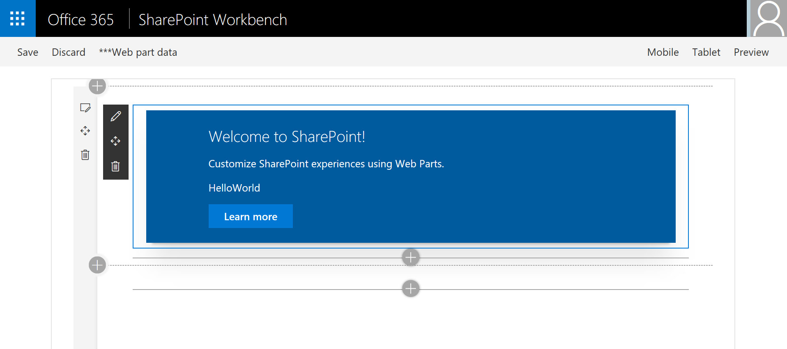

# React Functional Component web part

The purpose of this web part is to make it easier to understand for new developers building their first SPFx web part, when teaching the SharePoint Framework. The web part is a refactoring of the HelloWorld web part that is created by the **@microsoft/generator-sharepoint** Yeoman generator. The resulting rendered web part should look exactly the same, but the complexity of the code has been significantly reduced, and should be much easier to understand for a newcomer to the framework. 

It also introduces React Functional Components which offers a simpler way of building React Components using functions instead of classes.

## HelloWorldWebPart.ts Simplification

A number of simplifications have been made to the HelloWorldWebPart.ts file to make it easier to follow. 

The use of an external string collection has been removed. This is only needed in multilingual situations and can be added as and when needed. For a first web part there is really no need to have the student wondering where these strings are defined. For this sample they are simply hard coded into the file to make it clear how the property pane configuration works.

The external interface to define the properties is moved from a separate file and inline into HelloWorldWebPart.ts. This interface is used by the web part and the component on the assumption that all the properties will be passed to the component as props. Adding more properties is simply a matter of adding them to the IHelloWorldProps interface, adding a section to the getPropertyPaneConfiguration return value and adding a default to the manifest file if needed. The property will then be available to the component through its **props** collection.

## Functional Component

The HelloWorld.tsx React Component has been refactored as a pure functional component. This simplifies the code structure and will also gain you additional kudos when talking to computer scientists and functional code enthusiasts. The structure is a simple JavaScript function with the name of the component, a single argument containing the React props, and a simple return of the component rendering. Because it is just a function, there is no need to worry about **this** or **that**, constructors etc.

In addition the React elements returned have been simplified. In particular the "Learn more" button, which was constructed from HTML primitives in the Yeoman-generated sample, has been replaced by an Office-UI-Fabric PrimaryButton component. This also means that it has been possible to greatly simplify the SASS file HelloWorld.module.scss.

## Adding State

You may be wondering how maintaining state, side effects or other complexities can be accomodated with functional components like the one used. This can be achieved using a fairly new feature called [React Hooks](https://reactjs.org/docs/hooks-intro.html) and will be demonstrated using [another sample](https://github.com/SharePoint/sp-dev-fx-webparts/tree/master/samples/react-functional-stateful-component).

## Building and testing

In the react-functional-component directory run **npm install** to resolve all the dependencies. Once this has completed you can run **gulp serve** to test the web part in the local workbench.

This sample was built with version 1.82 of the SharePoint Framework. It has been modified to use version 16.8 of the React framework (by default the version used is React 16.7). React 16.8 supports React Hooks although this is not needed in the sample code because HelloWorld.tsx is a pure (or stateless) functional component.

