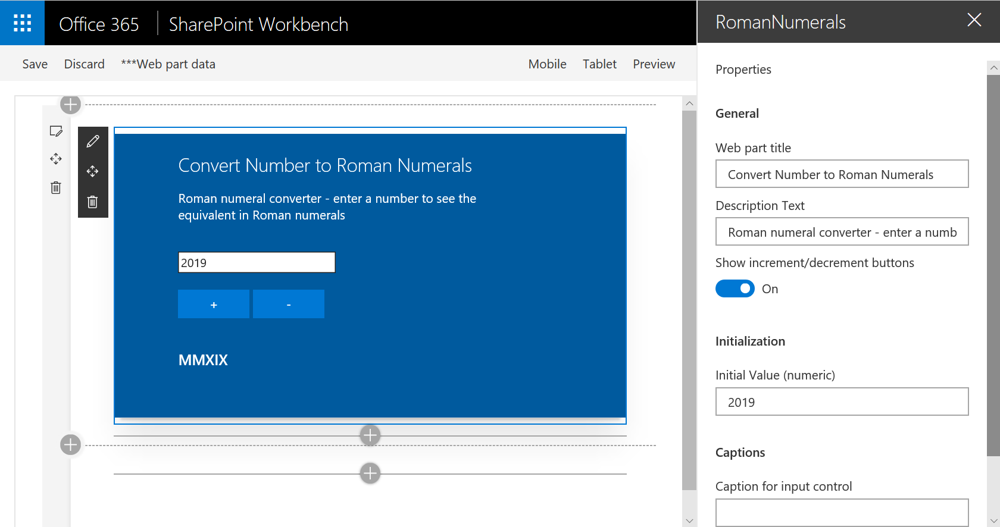

# React Functional Stateful Component web part

## Summary

This web part demonstrates building a React functional component that includes state, using the recently introduced React Hooks feature. The example web part renders a number to Roman numerals conversion tool.



## Used SharePoint Framework Version


## Applies to

* [SharePoint Framework](https:/dev.office.com/sharepoint)
* [Office 365 tenant](https://dev.office.com/sharepoint/docs/spfx/set-up-your-development-environment)

## Prerequisites

This sample was built with version 1.82 of the SharePoint Framework. It has been modified to use version 16.8 of the React framework (by default the version used is React 16.7). React 16.8 supports React Hooks which is required to support state management in a React functional component.

## Solution

Solution|Author(s)
--------|---------
react-functional-stateful-component | Bill Ayers

## Version history

Version|Date|Comments
-------|----|--------
1.0|June 5, 2019|Initial release

## Disclaimer

**THIS CODE IS PROVIDED *AS IS* WITHOUT WARRANTY OF ANY KIND, EITHER EXPRESS OR IMPLIED, INCLUDING ANY IMPLIED WARRANTIES OF FITNESS FOR A PARTICULAR PURPOSE, MERCHANTABILITY, OR NON-INFRINGEMENT.**

---

## Minimal Path to Awesome

* Clone this repository
* Move to /samples/react-functional-stateful-component folder
* At the command line run:
  * `npm install`
  * `gulp serve`

## Features

The purpose of this web part is to demonstrate building a React functional component that includes state. This is achieved using the recent React Hooks feature. The resulting code is cleaner and easier to follow than using a JavaScript/TypeScript class derived from React.Component. The example web part renders a number to Roman numerals conversion tool, although the functionality is just for the purposes of the demonstration.

This is an extension of the approach used in the [React-Functional-Component](https://github.com/SharePoint/sp-dev-fx-webparts/tree/master/samples/react-functional-component) sample.

* Simplification
* Functional Component
* Adding State


## RomanNumeralsWebPart.ts Simplification

A number of simplifications have been made to the RomanNumeralsWebPart.ts file to make it easier to follow compared to the Yeoman generator starter project. The use of an external string collection has been removed - they are simply hard coded into the file to make it clear how the property pane configuration works.

The external interface to define the properties is moved from a separate file and inline into RomanNumeralsWebPart.ts. This interface is used by the web part and the component on the assumption that all the properties will be passed to the component as props. The property will then be available to the component through its **props** collection.

## Functional Component

The RomanNumerals.tsx React Component is a React functional component. This simplifies the code structure to a simple JavaScript function with the name of the component, a single argument containing the React props, and a simple return of the component rendering. Because it is just a function, there is no need to worry about **this** or **that**, constructors etc. In this example we are introducing state, so this is not a "pure" or "stateless" functional component. For a more complicated example it might be advantageous to break the component down into several nested components, some of which may well be stateless. Stateless components are very simple and trivially easy to test. But typically we need to manage the state for at least some of our components as described below.

## Adding State

State is managed by means of a fairly new feature called [React Hooks](https://reactjs.org/docs/hooks-intro.html). On line 11 of RomanNumerals.tsx the React.useState function is used to provide state:

```
  const [value, setValue] = React.useState(parseInt(props.initialValue));
```
React.useState takes an initial value for the state variable and returns an array of two objects. The first is a variable containing the state value, and the second is a setter function for the value. We could refer to these as state[0] and state[1] or something, but the convention is to use the array destructuring operator to unpack them into local constants. The name of these is not important but a good practice is to use the form *[foo, setFoo]*, etc. Whenever we need to use the current value of the state variable we just refer to it (e.g. *{value}*), and wherever we need to change the value we call *useState(newValue)*. There is no need to use **this** because we are not inside a class, nor do we need to worry about the context of the **this** value, nor create a constructor to initialize state.

In the code we use the number input control to change the value of the state using a local function *onChange*, which simply sets a new value as the user types in characters. We also have a couple of additional buttons that can be used to increment and decrement the value which also demonstrates updating state with inline functions. Everything just works because the React framework will re-render the component whenever we update the state variable using the *setValue* function. If you need more complex state you could pass a more complex object to *useState* but a better approach is often to simply call *useState* once for each variable that makes up the state.

The output rendering uses the value of the state variable and does a conversion using the *romanToString* function:

```
<h3>{props.resultCaption} {romanToString(value)}</h3>
```
The *resultCaption* property is also rendered if defined.

## Building and testing

In the react-functional-component directory run **npm install** to resolve all the dependencies. Once this has completed you can run **gulp serve** to test the web part in the local workbench.


