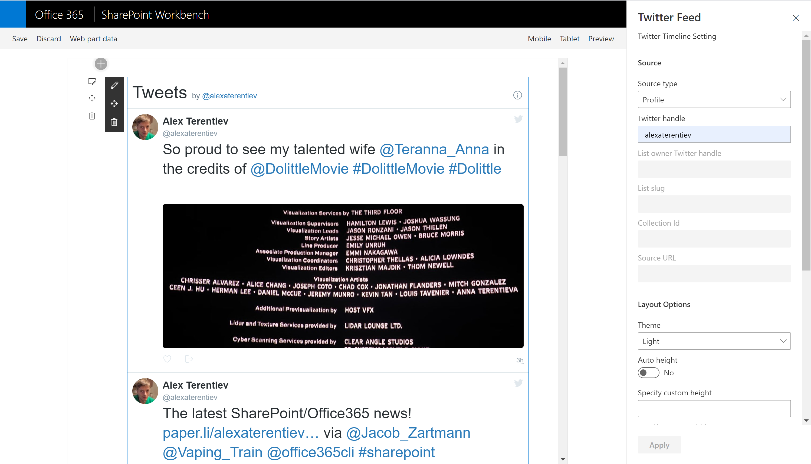

# React Twitter Timeline

Sample web part to display Twittier timeline

## Used SharePoint Framework Version 

## Applies to

* [SharePoint Framework](http://dev.office.com/sharepoint/docs/spfx/sharepoint-framework-overview)
* [Office 365 developer tenant](http://dev.office.com/sharepoint/docs/spfx/set-up-your-developer-tenant)

## Solution

Solution|Author(s)
--------|---------
react-twitter-client-side-solution|[AJIXuMuK](https://github.com/AJIXuMuK)

## Version history

Version|Date|Comments
-------|----|--------
1.0|January 20, 2020|Initial release

## Disclaimer
**THIS CODE IS PROVIDED *AS IS* WITHOUT WARRANTY OF ANY KIND, EITHER EXPRESS OR IMPLIED, INCLUDING ANY IMPLIED WARRANTIES OF FITNESS FOR A PARTICULAR PURPOSE, MERCHANTABILITY, OR NON-INFRINGEMENT.**

---

## Minimal Path to Awesome

* clone this repo
* move to right folder
* in the command line run:
  * `npm install`
  * `gulp bundle --ship`
  * `gulp package-solution --ship`
* from the _sharepoint/solution_ folder, deploy the .sppkg file to the App catalog in your tenant
* in the site where you want to test this solution
  * add the app named _page-sections-navigation-client-side-solution_
  * edit a page
  * add _Page Sections Navigation_ web part
  * add as much _Page Sections Navigation Anchor_ web parts as you want - each anchor adds an item to the navigation
  * configure web parts

## Features

This sample illustrates how to use [react-twitter-embed](https://www.npmjs.com/package/react-twitter-embed) module to display Twitter timeline of specific profile, likes, list, collection or url.
It also uses [PnP React Controls](https://github.com/SharePoint/sp-dev-fx-controls-react) and [PnP Property Controls](https://github.com/SharePoint/sp-dev-fx-property-controls) for rich web part and property pane components.
